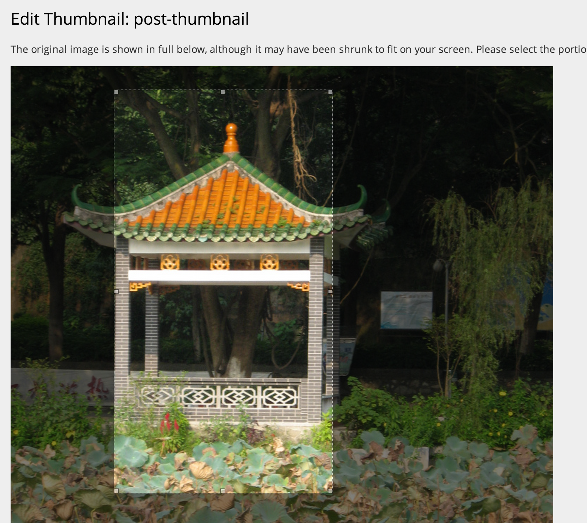

# wpcom-thumbnail-editor
Since thumbnails are generated on-demand on WordPress.com, thumbnail cropping location must be set via the URL.

This plugin adds a "Show Thumbnails" button on the attachment Edit screen (wp-admin/post.php?post=123&action=edit) where individual image subsizes can be selected and cropped.

**NOTE: The plugin is not maintained and should be considered deprecated.**

### WordPress VIP

There is a [beta release](https://github.com/Automattic/wpcom-thumbnail-editor/releases/tag/1.0.2-wpvip-beta) validated for WPVIP.com compatibility as of November, 2022. Thanks to Ben May @ The Code Company for the contribution to this release.

### What does this plugin do?

The plugin provides a helpful interface for direct control over the look of your thumbnail images. Select the crop location and portion of the fullsize image you'd like to use and the plugin takes care of the rest.

### How do I set it up?

After you've activated the plugin, edit any image, and you'll see a new "Show Thumbnails" button:

When you click the thumbnail to edit, you'll be taken to a screen where you can crop your image:

### Ratio Mapping Support

If you have 10 different 3:2 images and you want to apply the same crop to them all, you have to edit each one individually. The plugin supports ratio mapping, which is like saying "all these add\_image\_size definitions belong together". Instead of having the user edit every single thumbnail, they only need to edit one image per ratio definition.

Photon is smart enough so that you can save the same coordinates for each image definition and have it output a cropped result that is proportionate. When the user saves one image for a given ratio, it looks at the image ratio map and just updates the meta value so it applies to all the similar crops for that image.

Here's how you can define a custom image map:

    add_filter( 'wpcom_thumbnail_editor_args', function( $args ) {
    	$args['image_ratio_map'] = array(
    		'3:2' =&gt; array(
    			'150x100',
    			'loop-thumbnail',
    			'slider-thumbnail',
    		),
    		'16:9' =&gt; array(
    			'slider-wide',
    			'post-header',
    		)
    	);

    	return $args;
    } );

The structure of the image\_ratio\_map looks something like:

    array(
    	'ratio-name' =&gt; array(
    		'image-size-name',
    	),
    );

If the image\_ratio\_map is not defined, the plugin will just default to standard behavior, which is individual crops for all image sizes.